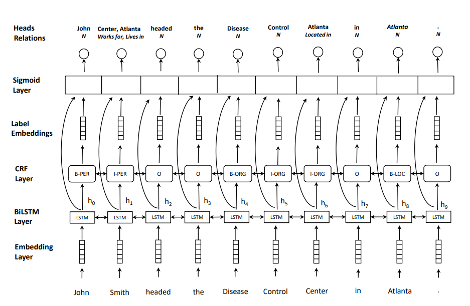
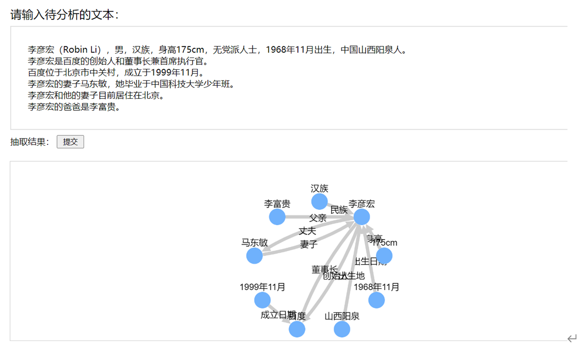
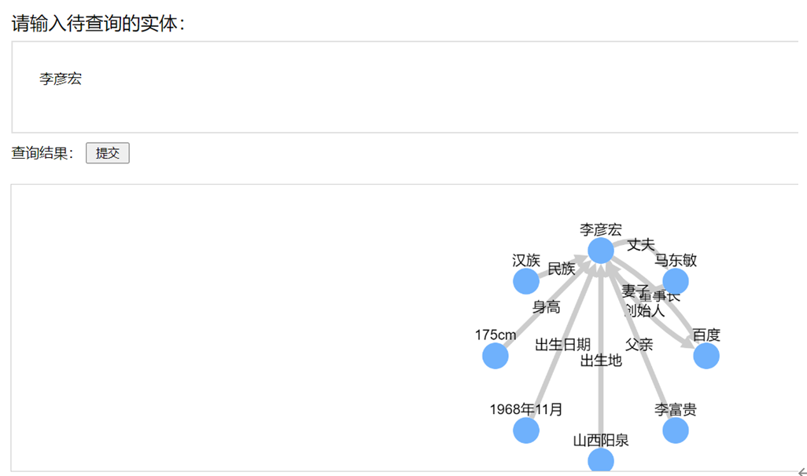
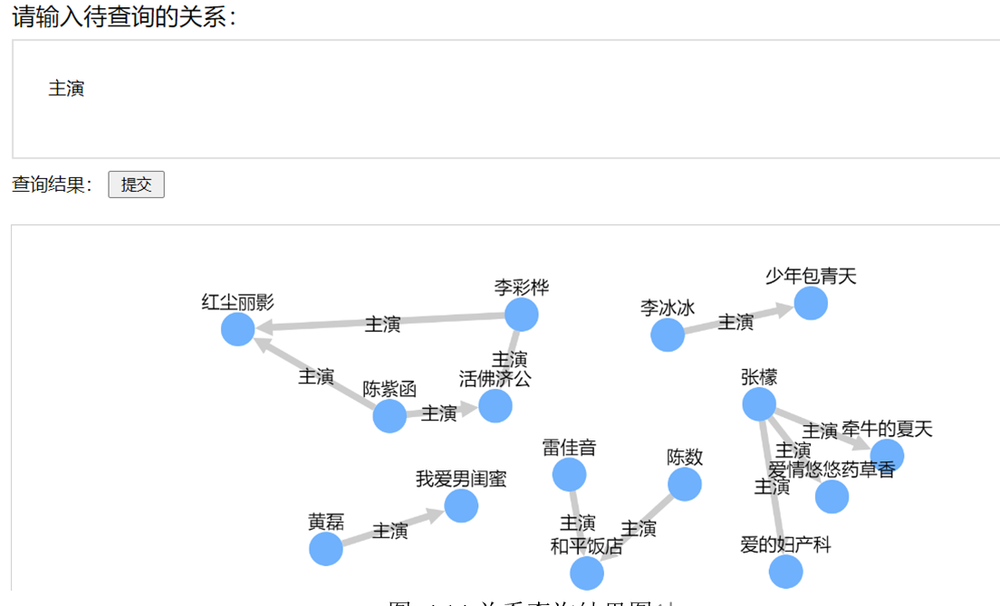

<!--
 * @Author: xmh
 * @Date: 2021-03-07 19:11:21
 * @LastEditors: xmh
 * @LastEditTime: 2021-05-20 21:37:30
 * @Description: 
 * @FilePath: \MultiHeadJointEntityRelationExtraction_simple\README.md
-->
# MultiHeadJointEntityRelationExtraction

PyTorch code for MultiHead:"Joint entity recognition and relation extraction as a multi-head selection problem".I use Chinese dataset to achieve chinese entity relation extraction.
I use albert as feature extractor to improve results.
For a description of the model and experiment, see paper https://arxiv.org/abs/1804.07847.




### Requirements

- torch==1.4.0+cu100
- cuda=10.0
- cudnn=7603
- pytorch-crf==0.7.2
- transformers==4.3.3
- tqdm==4.59.0
- seqeval==0.0.10
- tensorboard
- flask == 1.1.2

### Framework

I use flask as the back-end framework, Neo4j as the graph database.

### Dataset

Baidu CCKS2019 Competition

Download link: https://ai.baidu.com/broad/download?dataset=dureader

### Code Description
* checkpoint
&ensp;save the model regularly
* data
&ensp;save the data
* data_loader
&ensp;the code to save data process
* deploy
&ensp;demo code
* deploy_flask
&ensp;use flask web framework to deploy model
* doc
&ensp;save description files
* mains
&ensp; training code
* models
&ensp;save the model files
* modules
&ensp;the code of model
* pretrained
&ensp;save bert and albert pretrained files
* record
&ensp;save files about tensorboard
* test
&ensp;save test files while developing
* utils
&ensp;tool files


### Train

```
cd Projects/MultiHeadJointEntityRelationExtraction_simple/mains
python3 trainer.py
```

### Deployment

```
cd Projects/MultiHeadJointEntityRelationExtraction_simple/deploy_flask
python3 manage.py
```

Results:
Input text and output relation extraction results.

Input the name of the entity and output all the knowledge related to the entity.

Input the name of the relationship and output all the knowledge with the relationship.

